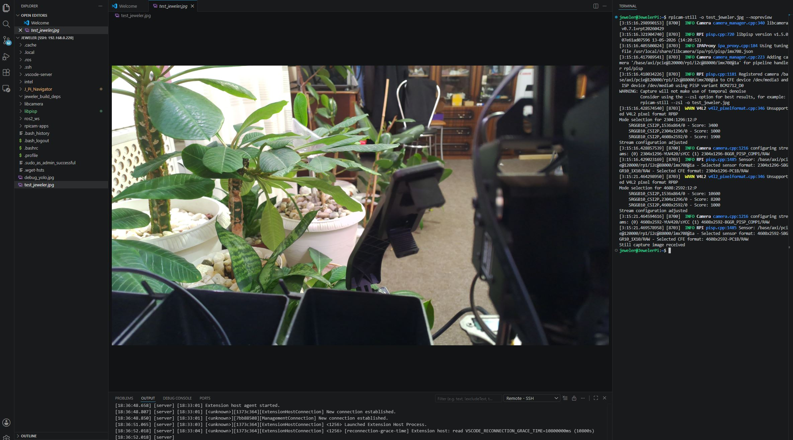
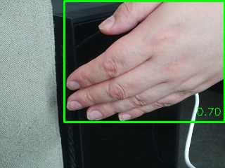
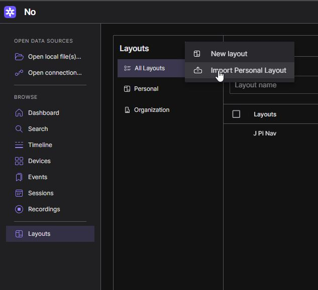
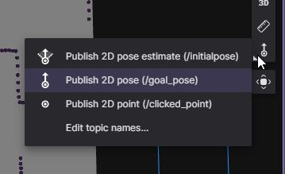
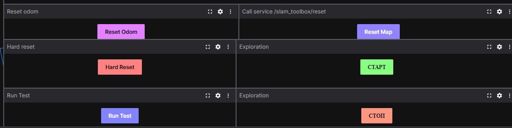

# 🧭 Jeweler Pi Navigator — Руководство по установке

Инсталлятор адаптирован для **Raspberry Pi 5** под управлением **Ubuntu Server 24.04 LTS**. 

---

### 📦 Шаг 1. Подготовка и запись OS

Для установки вам понадобится чистая карта памяти MicroSD.

1. Скачайте и запустите официальный [Raspberry Pi Imager](https://raspberrypi.com).
2. Выберите базовые параметры конфигурации:
   * **Device:** `Raspberry Pi 5`
   * **OS:** `Other general-purpose OS` ➡️ `Ubuntu` ➡️ `Ubuntu Server 24.04.X LTS (64-bit)`
   * **Storage:** Ваша карта MicroSD

3. Нажмите **Next** и перейдите в меню настройки параметров (**OS Customisation**):


| Параметр | Рекомендуемое значение | Примечание |
| :--- | :--- | :--- |
| **Hostname** | `JewelerPi` | Имя устройства в вашей локальной сети |
| **Localisation** | *На ваше усмотрение* | **Обязательно** оставьте раскладку клавиатуры `us` |
| **User** | `jeweler` | Запомните имя пользователя и пароль |
| **Wireless LAN** | *Данные вашего Wi-Fi* | Малинка должна иметь доступ в интернет |
| **Services** | Включить **SSH** (`✓ Enable SSH`) | Выберите аутентификацию по паролю или SSH-ключу |

4. Подтвердите запись и дождитесь окончания процесса. Все базовые утилиты удаленного доступа (`ssh`, `git`, `htop`) развернутся автоматически.
5. Вставьте MicroSD в Raspberry Pi 5 и включите её питание.

---

### 💻 Шаг 2. Подключение и клонирование репозитория

Рекомендуется использовать **VS Code** с установленным расширением **Remote - SSH** для удобной правки кода прямо на роботе.

1. Подключитесь к плате с основного компьютера через терминал или VS Code:
   ```bash
   ssh jeweler@JewelerPi.local
   # Или укажите прямой IP-адрес: ssh jeweler@192.168.X.X
   ```
2. Склонируйте репозиторий навигатора в домашнюю директорию:
   ```bash
   git clone https://github.com/Serg89spb/J_Pi_Navigator
   ```

---

### 🚀 Шаг 3. Запуск инсталлятора

Перейдите в папку проекта, выдайте права на исполнение автоматическому скрипту и запустите его:

```bash
cd ~/J_Pi_Navigator
chmod +x install.sh
./install.sh
```

> ⚠️ **Важная информация:**
> * Процесс сборки и компиляции зависимостей занимает **от 30 до 40 минут**.
> * Скрипт полностью безопасен к перезапускам. Если во время скачивания библиотек с GitHub оборвется связь, просто **запустите `./install.sh` повторно**. Он определит статус установки и продолжит с прерванного места.

---

### 🔄 Шаг 4. Проверка системы

1. После успешного завершения работы скрипта обязательно перезагрузите плату:
   ```bash
   sudo reboot
   ```
2. Подключите CSI-камеру к роботу и сделайте тестовый снимок, чтобы убедиться в корректности настройки видеодрайверов:
   ```bash
   rpicam-still -o test_jeweler.jpg --nopreview
   ```

---

### 📷 Шаг 5. Работа с тестовыми скриптами камеры

Для удобного просмотра полученных фотографий и видеороликов прямо в VS Code откройте домашнюю директорию через меню: `File` ➡️ `Open Folder` ➡️ `/home/jeweler/` (или ваше имя пользователя).


В репозитории предусмотрена папка `camera_test` со скриптами для проверки аппаратной части:

1. **`video_record.py`** — проверка записи видео.
   * Нажмите `Enter` для начала записи.
   * Нажмите `Ctrl + C` для завершения процесса.
2. **`yolo_test.py`** — проверка нейросетевой детекции объектов. Скрипт циклически обновляет и перезаписывает изображение. Открыв целевой файл в VS Code, вы сможете наблюдать за результатами работы модели в реальном времени.



---

### 🔌 Шаг 6. Подключение оборудования и настройка Foxglove

После успешного тестирования камеры можно подключать периферию: [ESP32S3 Chassis](https://github.com/Serg89spb/J_ESP32S3_Chassis) (через USB) и лидар **RPLidar C1**.

Для полноценного мониторинга и визуализации данных робота используется инструмент **Foxglove Studio**:

1. Зарегистрируйте аккаунт на [официальном сайте Foxglove](https://foxglove.dev).
2. Импортируйте готовую конфигурацию панелей из главного репозитория: `Jeweler_Robot/Visualization/Foxglove/Layouts/J Pi Nav.json`.
3. Убедитесь, что в настройках подключения указан порт **`8765`** (стандартный порт, зашитый в лаунчерах проекта).



---

### 🚀 Шаг 7. Запуск навигационной системы ROS 2

В зависимости от ваших задач выберите один из двух доступных сценариев запуска системы.

#### Вариант А. Работа с реальным физическим роботом
Для старта основного лаунчера управления аппаратной платформой выполните команду:
```bash
ros2 launch jeweler_nav robot_launch_nav.py
```

#### Вариант Б. Запуск в симуляции Unreal Engine
Если вы хотите протестировать навигацию в виртуальной среде симулятора, запустите:
```bash
ros2 launch jeweler_nav robot_launch_ue_nav.py
```
> 📖 Подробное руководство по настройке виртуального окружения доступно в [Инструкции по работе с Unreal Engine](https://github.com/Serg89spb/J_UE_Sim).

---

### 🕹️ Шаг 8. Управление роботом и автономный режим

#### Задание целевой точки (Goal Pose)
Чтобы отправить робота в определенную координату вручную:
1. В Foxglove Studio найдите вертикальную панель инструментов в верхнем правом углу основной карты.
2. Нажмите на иконку стрелочки или круга (инструмент задания цели).
3. Выберите топик **`/goal_pose`** и укажите точку на карте в пределах достижимой (свободной от препятствий) зоны.



#### Панель управления и режим исследования (Exploration)
В нижней правой части интерфейса расположена панель сервисных команд робота:



* **Reset Odom** — Сброс накопленной ошибки одометрии контроллера физического робота. Рекомендуется использовать совместно со следующей командой.
* **Reset Map** — Полное обнуление текущей построенной SLAM-карты.
* **Hard Reset** — Горячая перезагрузка всех фоновых ROS 2 сервисов на Raspberry Pi.
* **Run Test** — Запуск экспресс-диагностики систем. Робот выполнит несколько коротких маневров на месте для верификации корректности показаний энкодеров.
* **Exploration (СТАРТ / СТОП)** — Запуск и принудительная остановка алгоритма автономного исследования пространства и построения карты без участия оператора.

---

🤖 **Желаем удачи в освоении и развитии экосистемы Jeweler!**
